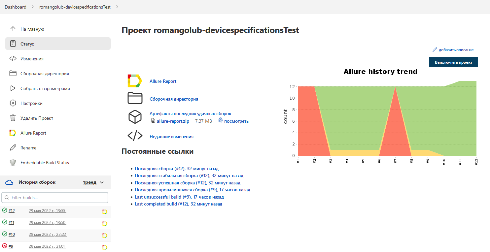
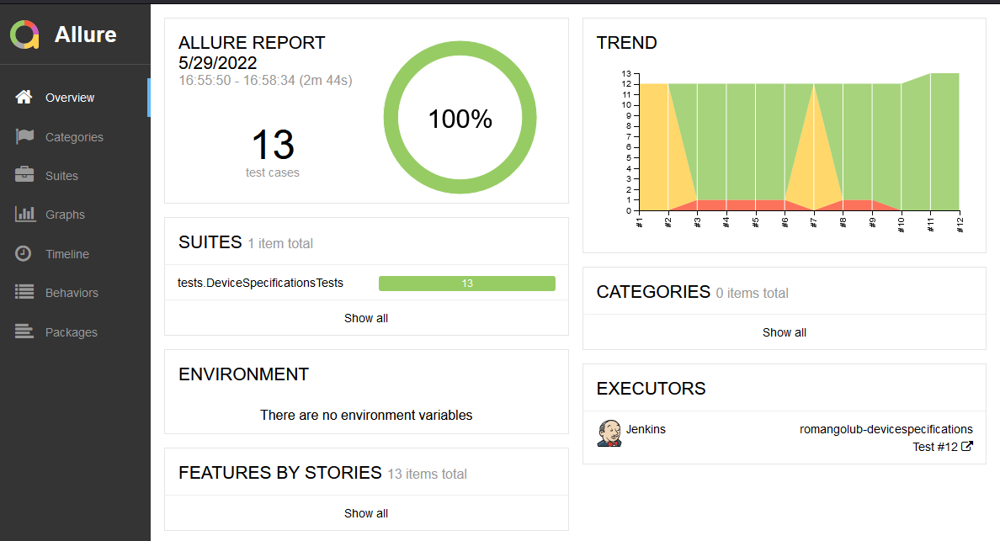
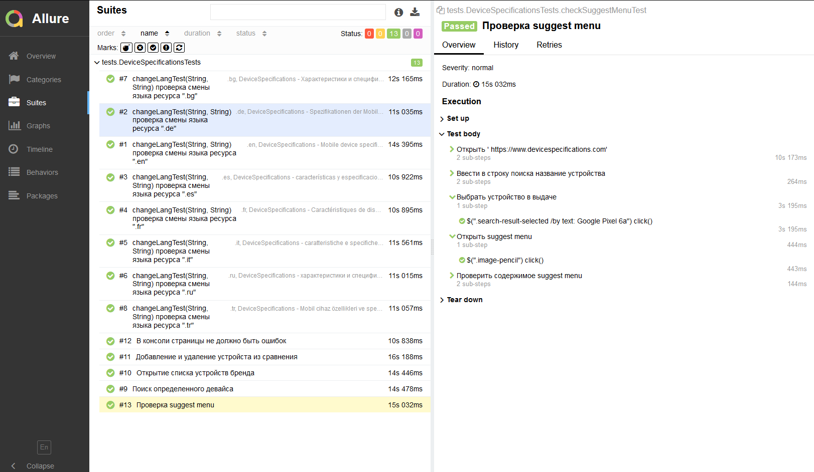
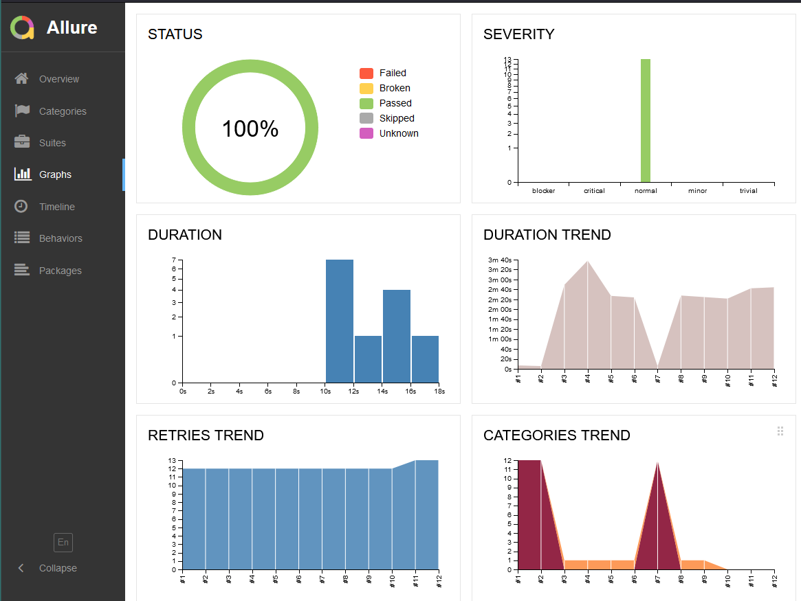
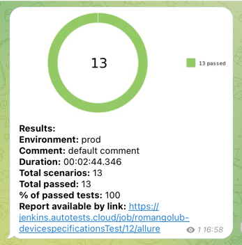
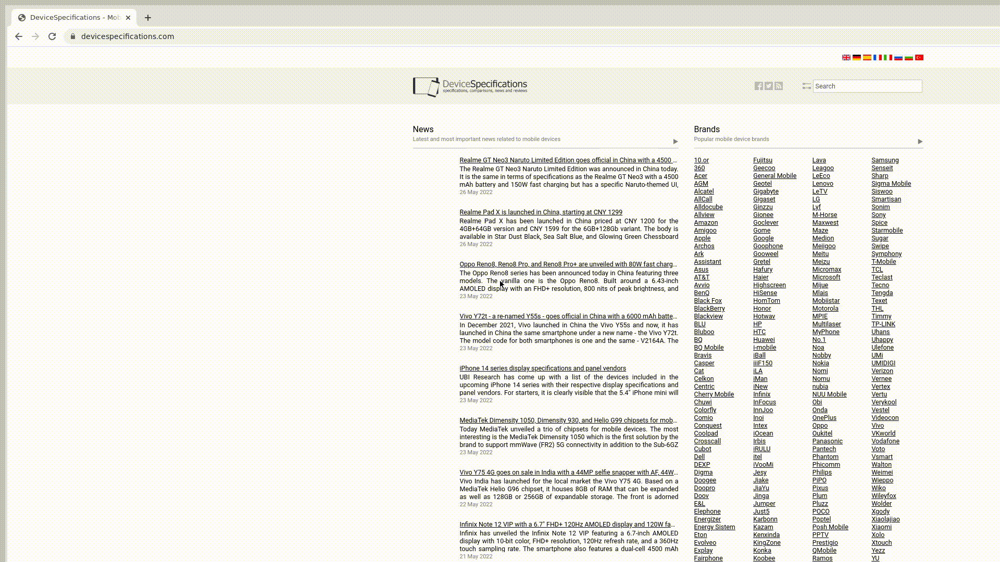

# Проект по автоматизации тестирования для devicespecifications.com
## <a target="_blank" href="https://www.devicespecifications.com/">Веб сайт devicespecifications</a>

## Содержание:

- <a href="#технологии-и-инструменты">Технологии и инструменты</a>
- <a href="#реализованные-проверки">Реализованные проверки</a>
- <a href="#запуск-из-терминала">Запуск из терминала</a>
- <a href="#сборка-в-Jenkins">Сборка в Jenkins</a>
- <a href="#allure-отчет">Allure отчет</a>
- <a href="#отчет-в-telegram">Отчет в Telegram</a>
- <a href="#видео-пример-прохождения-тестов">Видео пример прохождения тестов</a>


## Технологии и инструменты
<p align="center">


</p>

## Реализованные проверки
- Открытие списка устройств бренда
- Смена языка ресурса (Параметризированные тесты)
- Поиск определенного девайса
- Добавление и удаление устройста из сравнения
- Проверка suggest menu
- Проверка отсутсвия ошибок в консоли

## Запуск из терминала
### Локальный запуск 
```bash
gradle clean test -Drun=local
```

### Удаленный запуск

```bash
clean test  
-Dbrowser=${browser} 
-DbrowserVersion=${browserVersion} 
-DbrowserSize=${browserSize} 
-DremoteDriverUrl=${remoteDriverUrl}
```

## :Сборка в Jenkins
### <a target="_blank" href="https://jenkins.autotests.cloud/job/011-katana_sword_party-13-autotests/">Сборка в Jenkins</a>
<p align="center">

</p>

## :Allure отчет
- ### Главный экран отчета
<p align="center">

</p>

- ### Страница с проведенными тестами
<p align="center">

</p>

- ### График
<p align="center">

</p>

## Отчет в Telegram
<p align="center">

</p>

## :Видео пример прохождения тестов
> Видео прилагается к каджому тесту
<p align="center">
  
</p>
